  <h3>⚡ Main Stack ⚡</h3>

   
  
  
  
  
  

   

  
  
  
  
  

   

   
  
  
  

    

  <h3>🌱 Sub Stack 🌱</h3>

   
   
  
  
   
  

   

   
  
   
  
  

   

   
   
  

     

  <h3>🔗 Links 🔗</h3>

  
  
  
  

    

  

    

  

  

  

<!--
**jamie811/jamie811** is a ✨ _special_ ✨ repository because its `README.md` appears on your GitHub profile.
-->

